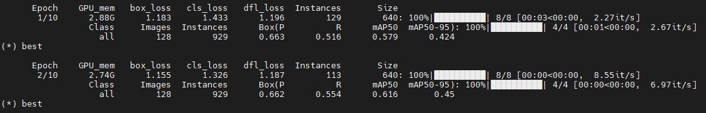

# Ultralytics Custom CLI Boilerplate Code

Boilerplate code for extending the [Ultralytics YOLOv8](https://github.com/ultralytics/ultralytics) codebase and CLI, using the Ultralytics repository as an external dependency.

# Brief Introduction
The most common method for adding custom code to the Ultralytics codebase, is by editing the Ultralytics repository,  and adding the custom functionality into the existing codebase. Compared to this method, I suggest adding custom code on top of the Ultralytics codebase, using the Ultralytics repository as an external dependency.

### Advantages:
- Reduced code clutter
- Changes are more visible
- Easily update the base Ultralytics version

The boilerplate code contains a simple extension, that includes adding a textual indication whenever the epoch has currently achieved the best fitness score. This is done by printing `(*) best` while training.

# Installation
The functionality depends on a [PR](https://github.com/ultralytics/ultralytics/pull/8298) currently pending in the Ultralytics repository. These changes can be previewed here:
```bash
git clone -b extend-cli https://github.com/deanmark/ultralytics.git
```
Install the current repo, and the modified ultralytics code by runnning `pip install .` in both directories.

# Usage
Use the Ultralytics [CLI](https://docs.ultralytics.com/usage/cli/) as usual, but using the new `yolo-custom` command. 
For example:

```bash
yolo-custom train data=coco128.yaml model=yolov8n.pt epochs=10 lr0=0.01
```

<p>
  <a href="https://github.com/cyrusbehr/YOLOv8-TensorRT-CPP">
    
  </a>
</p>
